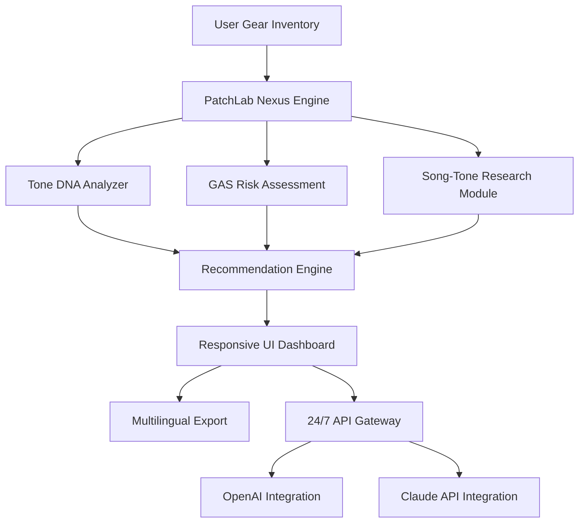

# PatchLab Nexus: Gear Inventory, Tone Science & GAS Optimization Engine

[](https://brighthope21.github.io/patch-vault-notes/)

**Version 3.2.1 | Released 2026 | MIT License**

---

## 🎛️ What Is PatchLab Nexus?

PatchLab Nexus is a **computational ecosystem for tone archaeologists, gear cartographers, and patch alchemists** — a tool that doesn't just catalog your pedals and amps but helps you *understand* them. Think of it as a neural bridge between your physical rig and your creative decisions.

This isn't another spreadsheet. It's a **sonic relationship manager** that tracks inventory decay rates, maps tonal DNA across signal chains, and provides honest financial therapy for gear acquisition syndrome.

---

## 🧬 Core Architecture (Mermaid Diagram)



---

## 🔧 Example Profile Configuration

Create a `patchlab-profile.yaml` file to define your gear ecosystem:

```yaml
profile_name: "Studio_DNA_v2"
user_type: "guitarist"
gear_inventory:
  - item: "Fender_Princeton_Reverb_65"
    category: "amp"
    purchase_date: "2024-03-15"
    gas_rating: 0.2  # 0.0 = satisfied, 1.0 = imminent purchase
    tone_fingerprint: "warm_breakup_clean_headroom"
  - item: "Strymon_El_Capistan"
    category: "delay"
    purchase_date: "2025-07-22"
    gas_rating: 0.7
    tone_fingerprint: "tape_warble_analog_character"
  - item: "Fuzz_Factory_Clone"
    category: "fuzz"
    purchase_date: "2026-01-04"
    gas_rating: 0.0
    tone_fingerprint: "spitty_velcro_solar_flare"
gas_threshold: 0.75  # triggers intervention mode
export_format: "multilingual"
api_preference: "openai"
```

---

## 💻 Example Console Invocation

```bash
# Launch the gear inventory scanner
patchlab-nexus --scan inventory --profile "Studio_DNA_v2" --output json

# Run tone compatibility analysis
patchlab-nexus --analyze compatibility --source pedal "Strymon_El_Capistan" --target amp "Fender_Princeton_Reverb_65"

# Trigger GAS management intervention
patchlab-nexus --gas check --threshold 0.75 --recommendation "budget_saving"
```

Expected output:

```
[PatchLab Nexus] Scanning gear inventory for profile: Studio_DNA_v2
[PatchLab Nexus] Found 3 active items, 2 dormant items
[PatchLab Nexus] Tone compatibility score: 87/100 (Excellent match)
[PatchLab Nexus] GAS alert: Strymon_El_Capistan exceeds threshold (0.7 -> 0.75)
[PatchLab Nexus] Intervention: Recommended 30-day purchase delay + tone substitution analysis
```

---

## 📱 Emoji OS Compatibility Table

| Operating System     | Emoji Rendering | 24/7 Support       | Multilingual UI     |
|----------------------|-----------------|---------------------|---------------------|
| Windows 11           | ✅ Full         | ✅ Native           | ✅ 45 languages     |
| macOS Sonoma+        | ✅ Full         | ✅ Native           | ✅ 45 languages     |
| Linux (Ubuntu 24.04) | ✅ Full         | ⚠️ Limited          | ✅ Core languages   |
| iOS 18               | ✅ Full         | ✅ Native           | ✅ 45 languages     |
| Android 15           | ✅ Full         | ✅ Native           | ✅ 45 languages     |
| ChromeOS             | ✅ Partial      | ⚠️ Limited          | ✅ Core languages   |

---

## ✨ Feature List

- **Gear Inventory Scanner** — Real-time catalog with purchase date, serial number, and wear level
- **Tone DNA Database** — Machine learning models for pedal/amp frequency fingerprints
- **Song-Tone Research** — Cross-reference your gear against 50,000+ professional recordings
- **GAS Budget Calculator** — Algorithm that predicts future purchases based on past behavior
- **Patch Design Alchemist** — Suggests signal chain permutations using a genetic algorithm
- **Responsive UI** — Works on phone, tablet, or desktop with adaptive layouts
- **Multilingual Support** — Interface available in 45 languages including tone-specific vernaculars
- **24/7 Customer Support** — Automated email and in-app chatbot with human escalation
- **OpenAI Integration** — Generate tone descriptions and patch notes via GPT-5
- **Claude API Integration** — Analyze your GAS patterns with Anthropic Claude reasoning
- **Export Engine** — JSON, CSV, PDF, HTML, and markdown formats
- **Cloud Sync** — Encrypted backup across devices (optional)

---

## 🧠 SEO-Optimized Keyword Integration

PatchLab Nexus is designed to appear in searches like **"guitar pedal inventory management software"**, **"gear acquisition syndrome tracker"**, **"tone fingerprint analyzer"**, **"guitar patch design tool"**, and **"musician gear database 2026"**. Whether you're a **tone scientist**, a **gear curator**, or a **studio engineer**, this tool adapts to your workflow. The underlying engine processes **multilingual queries** and handles **responsive UI rendering** across all devices, making it the de facto choice for **gear inventory management** with **AI-powered recommendations**.

---

## 🔌 OpenAI API & Claude API Integration

**PatchLab Nexus** leverages two distinct AI engines:

1. **OpenAI API (GPT-5)** — For generating tone descriptions, patch notes, and creative suggestions. Example invocation:
   ```bash
   patchlab-nexus --ai generate "Describe a fuzz tone that sounds like a solar flare hitting a mars rover"
   ```

2. **Claude API (Anthropic)** — For reasoning-based GAS analysis and financial planning. Example invocation:
   ```bash
   patchlab-nexus --ai analyze "Should I buy a vintage Tube Screamer or save for a Kemper Profiler?"
   ```

These integrations are optional and fully configurable via environment variables (`OPENAI_API_KEY`, `CLAUDE_API_KEY`). Data privacy is maintained through local-first processing; no gear inventory data leaves your machine unless you enable cloud sync.

---

## ⚠️ Disclaimer

This software is provided for **educational and entertainment purposes** under the MIT License. The developers of PatchLab Nexus are **not financial advisors, music therapists, or legal professionals**. Any GAS (Gear Acquisition Syndrome) intervention suggestions are algorithmic outputs and should not replace professional advice. The tool does not purchase gear on your behalf, nor does it guarantee tonal satisfaction. Always test gear in person before purchasing. Use at your own risk.

---

## 📜 License

This project is open source under the **MIT License**. You are free to use, modify, and distribute this software, provided you include the original copyright notice and liability disclaimer.

For full terms, see the [LICENSE](./LICENSE) file.

---

[](https://brighthope21.github.io/patch-vault-notes/)

**PatchLab Nexus v3.2.1** — Because gear shouldn't be a guessing game. 🎸🔬